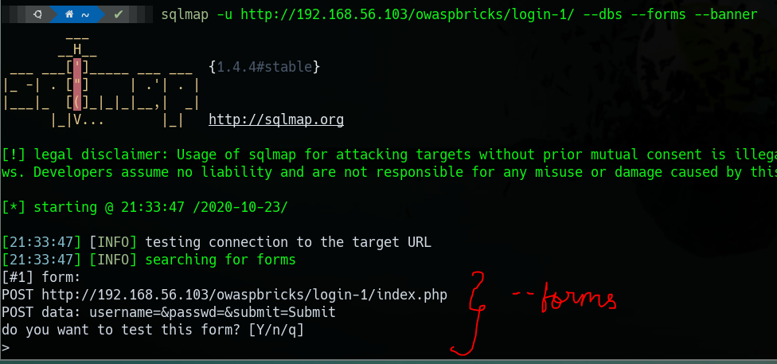

# SQLmap Exploitation

## Useful switches

* Levels
  * Testing level from \(low\) 1 to \(highest\) 5.
  * The higher the level, it will use a larger number of payload when testing injection points.
    * "Injection points" like default is "GET" and "POST", whereas in higher levels it will include "User-Agent", "Cookie" value and other header fields.
* Risks
  * Testing risk from \(Low\) 1 to \(Highest\) 3.
  * More risky injection techniques could affect the normal working of database, and will use unsafe SQL queries which could also updating and modifying database entries.
* Techniques
  * Injection Techniques : Boolean Based Injection, Error based injection, Union based, stacked queries, time based, blind injection, inline injections, 
  * By Default, SQLmap will try all the Injection techniques.

### SQLmap Syntax

Ref : [https://resources.infosecinstitute.com/important-sqlmap-commands](https://resources.infosecinstitute.com/important-sqlmap-commands)

* [https://app.gitbook.com/@takshil-patil529/s/linux/kali-linux/sqlmap-1](https://app.gitbook.com/@takshil-patil529/s/linux/kali-linux/sqlmap-1)
* SQLMap with timeout for WAF evasion
  * sqlmap -r request.req --tamper=charunicodeescape --delay 5 --level 5 --risk 3 --batch
    * -r : specify the HTTP Request data
    * --tamper : Sepcify the URL encoding to use while fuzzing using SQLMap
    * --delay : Specify time delay n seconds for each subsequent request.
    * --level : Specifies the number of checks/payloads to be performed. Level 5 means all possible **number of checks/exploits** will be performed.
    * --risk : Specifies the **type of payload**. Level 3 means all types of SQLi payloads.

## Attack Example

* `sqlmap -u http://192.168.56.103/owaspbricks/login-1/ --forms --banner --fresh-queries --flush-session`
  * `--forms` to automatically fetch the parameters of the login form, you need to validate the fetched parameters once the attack starts.
  * `--banner` to fetch the version details and other banner information.
  * `--fresh-queries` it ignores and stored exploit sessions and starts attack fresh.

## Working of SQLMap

* **Step 1 :** Run sql map either with null parameters \(SQLmap will ask to add random variables later\) or supply some random value to parameters \(here there are three parameters "username" and "passwd"  and "submit"\)

\*\*\*\*

* **Step 2 :** It will start to ask question on to proceed with the attack. \(e.g what risk and level to scan, whether to proceed with attack if a vulnerable parameter is identified, etc.\)

\*\*\*\*

* **Step 3 :** We could increase the threshold of "level" or "risk" to perfrom a more through SQLi with a lot of testing in depth. For this attack level=1 and risk=1

\*\*\*\*

* **Step 4 :** A successful SQLi

\*\*\*\*

* **Step 5 :** Optimizing SQLi to execute queries quickly

* **Step 6 :** The Final step is to get message as below

