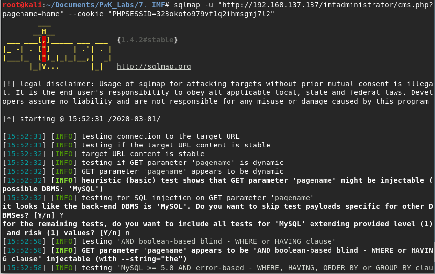

# Compiling C/C++ code

## Steps

* We try to compile the .c file on the victim system first. 
* If we are unable to do so, we compile it on the attacker system with proper compatibility. 

## Linux architecture version

1.  x86-64 \(also known as x64, x86\_64, AMD64 and Intel 64\) is the **64-bit** version of the x86 instruction set.
2. i686 is the **32 bit** version of the x86 instruction set.
3. i368 is the **32 bit** version of the x86 instruction set.

## compiling c code in linux for windows environment

Installing the cross-compilation

```text
sudo apt-get install mingw-w64
```

32bit

```text
i686-w64-mingw32-gcc -o test.exe test.c
or
i686-w64-mingw32-gcc test.c -lws2_32 -o test.exe
```

64bit

```text
x86_64-w64-mingw32-gcc -o test.exe test.c
```

ref : [https://stackoverflow.com/questions/44670209/how-to-compile-c-code-in-linux-to-run-on-windows](https://stackoverflow.com/questions/44670209/how-to-compile-c-code-in-linux-to-run-on-windows)

## compiling c code in linux for linux environment

* `gcc test.c -o exec_run`



### compiling a c code in 32bit linux

* `gcc test.c -m32 -o exec_run`

