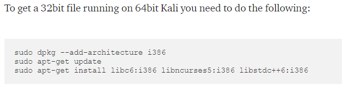

# Working of session

* User goes to a website.
* He goes to the login page in the website.
* Given user has an account in this website, he logins with his credentials.
* Once logged in successfully, he/she receives a session ID and authenticated cookie for the authenticated session.
* Hence now every time the user need to access his files in the website, he does not have to authenticate everytime and uses the session ID and authenticated cookie.
  * Why this? Because user is connecting using HTTP or HTTPS protocol which is a stateless protocol. Which means that user need to authenticate every time it has to access his personal data in the website.
  * But using session ID and authenticated cookie, he could use this session ID for consecutive connections. 
  * The session ID does expires depending on the designer who designed the website.

## Case Study 1 : sqlmap

### Problem :

I was able to somehow bypass login information, but it was a complex thing, I used burp suite for this. After exploiting I came to know that it has SQL Injection vulnerability. I was not able to manually perform SQL Injection, so I tried to use "sqlmap". But unfortunately SQLMap failed to show the result.

But I know it is vulnerable to SQL Injection.

### But how come SQL injection worked with "browser" vs "SQLMap"?

* One reason is that, in browser we logged in to the login page. We bypassed the login page somehow which is difficult to replicate using SQLmap.

We cannot replicate this login bypass using SQLmap.

### Solution :

* To solve this problem, we could use "sessions" to solve our problem.
* When we successfully logged in to "rmichaels" user, a unique session ID is created for a limited amount of time.
* If we have this session ID we could use this, in any 3rd party app like sqlmap. The 3rd party app now connects to the webserver using this authenticated session ID, and our problem is solved.
* `sqlmap -u "http://192.168.137.137/imfadministrator/cms.php?pagename=home" --cookie "PHPSESSIONID=323okoto979vf1q2ihmsgmj7l2"`

